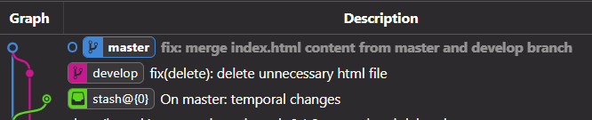

<h1>Git Flow Tutorial</h1>
<h3>"Basic Tutorial on How to Manage Branches Using Gitflow: Step-by-Step Guide"
.</h3>

<h1> Init repository and git flow</h1>
<h3>
      1) git init => <em>initialize repository</em> =>
      <em>created master branch</em>
</h3>
  <h3>
      2) git flow init => <em>initialize Git Flow</em> =>
      <em>created develop branch</em>
</h3>
<h1> Create Feature Branch</h1>
 <h3>
      3) git flow feature start namefeature =>
      <em>temporary branch namefeature created</em>
</h3>

<h3>4) git add .</h3>

<h3>5) git commit</h3>

<h3>6) repeat 3.1:</h3>

<h3>7) git flow feature finish namefeature</h3>

IMPORTANT!: using (start - finish) commands requires a minimum of two
commits to see the history of the temporary branch (<strong
>Git Flow documentation</strong>).

*********************************

<h1>Create Release Branch</h1>
<h3> 1) git flow release start 0.1.0 =>
      <em>short branch release/0.1.0 created</em>
</h3>
<h3>2) Make some change to commit</h3>
<h3>3) git add .</h3>
<h3>4) git commit</h3>
<h3>
      5) git flow release finish 0.1.0 =>
      <em>short branch release/0.1.0 merged and deleted</em>
</h3>

*********************************

<h1> Create Bugfix Branch</h1>
<h3>
      1) git flow bugfix start newerror =>
      <em>bug branch bugfix/newerror created</em>
</h3>
<h3>2) Fix bug</h3>
<h3>3) git add .</h3>
<h3>4) git commit</h3>
<h3>
      5) git flow bugfix finish newerror =>
      <em>bug branch bugfix/newerror merged and deleted</em>
</h3>

END

this readme has been made with html
